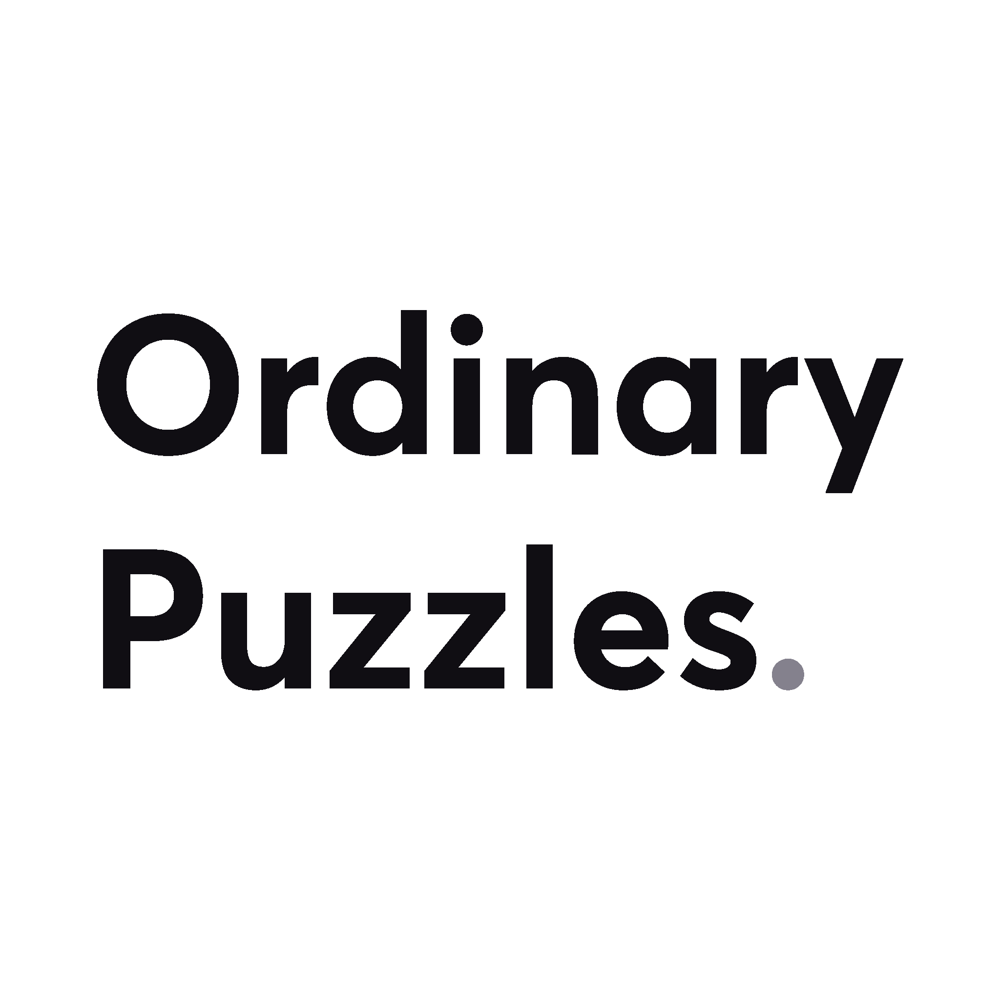

   
  
   
<h3 align="center">Ordinary Puzzles: A minimalistic puzzle game built with React-Native.</h3>

  
  
  

  

  
  

## Overview

Ordinary Puzzles is a minimalistic puzzle game build with [React Native](https://facebook.github.io/react-native/), [React Native for Web](https://github.com/necolas/react-native-web), [TypeScript](https://www.typescriptlang.org/) and [MobX](https://mobx.js.org/README.html).  
Ordinary Puzzles is free, has no ads, and no in-app purchases.  
You can download it on the [Google Play Store](https://play.google.com/store/apps/details?id=com.mmazzarolo.ordinarypuzzles), on the [Apple App Store](https://apps.apple.com/us/app/ordinary-puzzles/id1489599807), or play it directly [on the web](https://ordinarypuzzles.com/play) as a Progressive Web App.

## Some Background

Ordinary Puzzles is a game inspired by [Juho Snellman](https://www.snellman.net/)'s [Linjat](https://linjat.snellman.net/#fp).  
I discovered Linjat a while ago on Hacker News. I liked the concept of its Picross-like puzzles, so after a quick chat with Juho I decided to port it to a mobile game.

The font used across the entire app is [Averta](https://www.myfonts.com/fonts/intelligent-foundry/averta/), by [Kostas Bartsokas](http://www.kostasbartsokas.com/).  

## Contributing

See [CONTRIBUTING.md](./CONTRIBUTING.md).  
Pull requests are welcome. File an issue for ideas, conversation or feedback.
